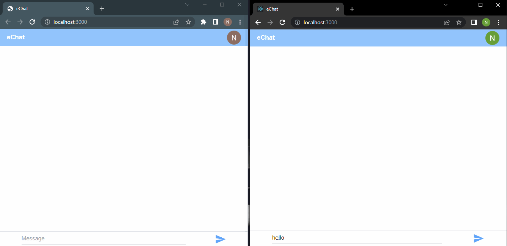

 # echat

Instant messaging platform that allows user to send, receive and delete messages

## Tools
React
Firebase
tailwind CSS

## Features

Sending and receiving text Messages


git

### INSTRUCTIONS TO RUN tHIS APP

Clone this repository.

```
https://github.com/norman-chifenga/echat.git
```

Add your web app's Firebase configuration
inside "./data/firebase.js"


Install dependencies
```
npm install
```

To start the development mode run

```
npm start dev
```
To build the application run
```
npm start build
```